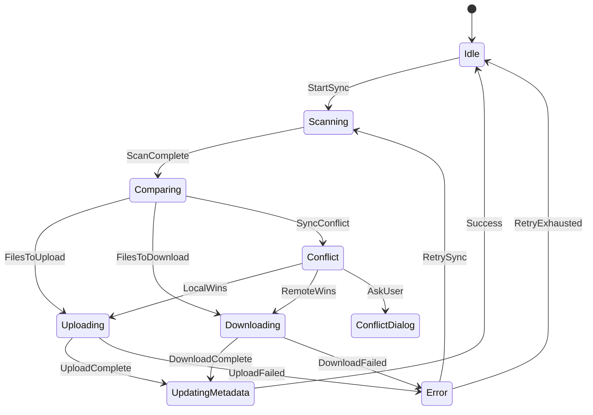

# 跨设备文件同步工具 （LightSync）- 详细需求规格说明

---

## 📋 修订历史

| 版本 | 日期     | 作者         | 修改内容               |
| ---- | -------- | ------------ | ---------------------- |
| 1.0  | 2024-... | 需求分析大师 | 初始需求概述           |
| 2.0  | 2024-... | 需求分析大师 | 深度需求分析与详细规格 |

---

## 🎯 1. 项目背景与目标

### 1.1 项目背景

在现代多设备工作环境中，用户经常需要在PC、Mac等多台设备间保持文件同步。现有解决方案存在以下痛点：

1. **商业软件资源消耗大** - Dropbox、OneDrive等商业同步软件内存占用通常超过200MB
2. **开源工具复杂性高** - Syncthing等专业工具功能过于复杂，学习成本高
3. **自定义需求难满足** - 无法根据个人使用习惯精确控制同步策略
4. **学习和技术成长需求** - 开发者希望通过实战项目掌握Rust和Tauri技术栈

### 1.2 项目愿景

打造一个**轻量级、高性能、可定制**的跨设备文件同步工具，同时作为现代Web技术栈的学习实践项目。

### 1.3 项目目标

| 目标类型     | 具体指标                                       | 测量标准      |
| ------------ | ---------------------------------------------- | ------------- |
| **性能目标** | 内存占用 < 50MB                                | 系统资源监控  |
|              | 启动时间 < 3秒                                 | 计时测试      |
|              | 文件扫描速度 > 1000个/秒                       | 性能基准测试  |
| **功能目标** | 支持3个以上WebDAV服务商                        | 兼容性测试    |
|              | 支持自定义的WebDAV同步方式                     | 兼容性测试    |
|              | 同步成功率 > 99%                               | 稳定性测试    |
|              | 支持最大1000个文件夹**（暂且当作后续优化项）** | 压力测试      |
| **学习目标** | 掌握Rust所有权、生命周期、异步编程             | 代码 Reviewed |
|              | 理解Tauri架构原理                              | 架构文档      |
|              | 完成可展示的开源项目                           | GitHub Stars  |

---

## 👥 2. 用户角色与用例

### 2.1 目标用户画像

#### 🎯 主用户：技术学习者 (30%)

**基本信息**:

- 职业: 软件开发者/技术学生
- 技术背景: 熟悉C++/Java/JavaScript
- 设备: MacBook (8GB-16GB RAM) + Windows PC

**核心需求**:

- 通过实际项目学习Rust/Tauri
- 需要轻量级工具日常使用
- 重视个人隐私和数据控制
- 喜欢可定制化解决方案

**使用场景**:

```
场景1: 学习实践
时间: 周末/晚上晚上
地点: 家里/办公室
行为: 开发、调试、学习新技术
目标: 掌握新技能，解决实际问题

场景2: 日常使用
时间: 工作日
地点: 多个场所
行为: 文件编辑、资料同步
目标: 保持工作文件一致性
```

#### 🎯 次用户：普通用户 (70%)

**基本信息**:

- 职业: 知识工作者/自由职业者
- 技术背景: 基础计算机操作
- 设备: 多台个人电脑

**核心需求**:

- 简单易用的文件同步
- 数据自主可控
- 不想付费使用商业服务

### 2.2 详细用例分析

#### 🔧 UC-001: 配置WebDAV服务器连接

| 类别                      | 内容                                                                                                                                                                                                                                                                                                                                                                                                                                                                                                                                                                                                              |
| ------------------------- | ----------------------------------------------------------------------------------------------------------------------------------------------------------------------------------------------------------------------------------------------------------------------------------------------------------------------------------------------------------------------------------------------------------------------------------------------------------------------------------------------------------------------------------------------------------------------------------------------------------------- |
| **用例ID**                | UC-001                                                                                                                                                                                                                                                                                                                                                                                                                                                                                                                                                                                                            |
| **用例名称**              | 配置WebDAV服务器连接                                                                                                                                                                                                                                                                                                                                                                                                                                                                                                                                                                                              |
| **简要描述**              | 用户配置第一个或多个WebDAV服务器连接，以便应用能够与远程存储服务进行通信。                                                                                                                                                                                                                                                                                                                                                                                                                                                                                                                                        |
| **参与者**                | 用户                                                                                                                                                                                                                                                                                                                                                                                                                                                                                                                                                                                                              |
| **涉众**                  | 用户：希望能够简单、快速、准确地配置并连接到自己的WebDAV服务器。<br>系统：需要获取准确、有效的连接信息才能执行后续的文件操作。                                                                                                                                                                                                                                                                                                                                                                                                                                                                                    |
| **前置条件**              | 应用已安装并启动。                                                                                                                                                                                                                                                                                                                                                                                                                                                                                                                                                                                                |
| **后置条件**              | 如果连接成功，系统保存服务器配置信息到服务器列表，并在远程服务器上创建默认的根目录结构。如果连接失败，系统状态不变，不保存任何信息。                                                                                                                                                                                                                                                                                                                                                                                                                                                                              |
| **基本事件流**            | （1）用例起始于用户需要配置一个新的WebDAV服务器连接。<br>（2）用户发起添加新服务器的操作。<br>（3）用户输入服务器所需的连接信息 (D-1)。<br>（4）用户请求系统验证所提供的信息。<br>（5）系统执行连接测试过程 (B-1)。<br>（6）系统向用户展示连接测试的结果。<br>（7）若验证成功，系统保存服务器配置信息 (D-1)。<br>（8）系统在WebDAV服务器上自动创建必要的默认根目录结构，用例结束。                                                                                                                                                                                                                                |
| **备选事件流**            | A-\* 用户在保存配置前的任何时候都可以中止该用例。<br>（1）系统取消当前操作，返回到服务器列表界面，用例结束。<br>A-1 连接测试失败，原因为网络不可达。<br>（1）系统显示网络不可达的错误信息，并提供网络诊断建议。<br>（2）用户可以修改信息后重新测试，或中止用例。<br>A-2 连接测试失败，原因为认证失败。<br>（1）系统显示认证失败的错误信息，并提示用户检查用户名和密码格式。<br>（2）用户可以修改信息后重新测试，或中止用例。<br>A-3 连接测试失败，原因为服务器兼容性问题（如不支持WebDAV）。<br>（1）系统显示服务器不兼容的错误信息，并提供服务器兼容性列表参考。<br>（2）用户可以修改URL后重新测试，或中止用例。 |
| **补充约束 - 数据需求**   | D - 1 服务器连接信息包括：<br>- 服务器名称（必填，用于显示）<br>- WebDAV URL（必填）<br>- 用户名（必填）<br>- 密码（必填，需加密存储）<br>- 连接超时时间（可选，默认值见 B-2）                                                                                                                                                                                                                                                                                                                                                                                                                                    |
| **补充约束 - 业务规则**   | B - 1 连接测试过程包括：<br>1. 向目标URL发送PROPFIND请求。<br>2. 使用提供的用户名和密码进行认证。<br>3. 验证对根目录的访问权限（是否可读取属性）。<br>B - 2 连接超时时间默认为30秒。<br>B - 3 支持对用户输入的URL格式进行自动纠错。                                                                                                                                                                                                                                                                                                                                                                               |
| **补充约束 - 非功能需求** | NF - 1 性能：连接测试操作应在5秒内完成（不包括网络延迟）。<br>NF - 2 安全性：用户密码必须使用操作系统的密钥环服务进行加密存储。<br>NF - 3 可用性：系统应能对常见的URL格式错误（如缺少协议前缀）进行自动纠正。                                                                                                                                                                                                                                                                                                                                                                                                     |
| **待解决问题**            | 暂无                                                                                                                                                                                                                                                                                                                                                                                                                                                                                                                                                                                                              |
| **相关图**                | 无                                                                                                                                                                                                                                                                                                                                                                                                                                                                                                                                                                                                                |

---

#### 📁 UC-002: 配置同步文件夹

| 类别                      | 内容                                                                                                                                                                                                                                                                                                                                                                                                                                                                                                                                                  |
| ------------------------- | ----------------------------------------------------------------------------------------------------------------------------------------------------------------------------------------------------------------------------------------------------------------------------------------------------------------------------------------------------------------------------------------------------------------------------------------------------------------------------------------------------------------------------------------------------- |
| **用例ID**                | UC-002                                                                                                                                                                                                                                                                                                                                                                                                                                                                                                                                                |
| **用例名称**              | 配置同步文件夹                                                                                                                                                                                                                                                                                                                                                                                                                                                                                                                                        |
| **简要描述**              | 用户指定需要同步的本地文件夹和对应的远程路径，并设置详细的同步策略。                                                                                                                                                                                                                                                                                                                                                                                                                                                                                  |
| **参与者**                | 用户                                                                                                                                                                                                                                                                                                                                                                                                                                                                                                                                                  |
| **涉众**                  | 用户：希望灵活地选择同步内容，并能精确控制同步行为以满足个人或团队需求。<br>系统：需要明确的本地-远程映射关系和同步规则才能正确执行同步任务。                                                                                                                                                                                                                                                                                                                                                                                                         |
| **前置条件**              | 用户已成功配置至少一个WebDAV服务器连接（用例UC-001已成功执行）。                                                                                                                                                                                                                                                                                                                                                                                                                                                                                      |
| **后置条件**              | 如果配置成功，系统将新的同步文件夹配置项保存到数据库中。如果配置失败，系统状态不变。                                                                                                                                                                                                                                                                                                                                                                                                                                                                  |
| **基本事件流**            | （1）用例起始于用户需要为已配置的服务器添加一个新的同步文件夹。<br>（2）用户在服务器列表中选择一个目标服务器。<br>（3）用户发起添加同步文件夹的操作。<br>（4）用户指定本地文件夹路径 (D-1)。<br>（5）系统获取并显示该本地文件夹的基本信息（大小、文件数量）。<br>（6）用户配置远程相对路径 (D-2)。<br>（7）系统验证远程路径的有效性 (B-1)。<br>（8）用户设置同步选项 (D-3)。<br>（9）用户配置高级规则（可选）(D-4)。<br>（10）用户请求保存配置。<br>（11）系统保存所有配置项到数据库，用例结束。                                                      |
| **备选事件流**            | A-\* 用户在保存配置前的任何时候都可以中止该用例。<br>（1）系统取消当前操作，返回到同步文件夹列表界面，用例结束。<br>A-1 用户指定的本地文件夹路径无效（如不存在、无读取权限）。<br>（1）系统提示路径无效，并说明原因。<br>（2）用户可以重新选择路径或中止用例。<br>A-2 用户配置的远程路径格式无效或不被允许。<br>（1）系统提示远程路径无效，并根据规则 (B-1) 给出建议。<br>（2）用户可以修改路径或中止用例。<br>A-3 系统无法获取本地文件夹信息（如权限不足）。<br>（1）系统提示无法访问该文件夹，并检查权限。<br>（2）用户可以重新选择路径或中止用例。 |
| **补充约束 - 数据需求**   | D - 1 本地文件夹信息：本地文件夹的绝对路径。<br>D - 2 远程路径信息：相对于WebDAV根目录的路径字符串。<br>D - 3 同步选项包括：<br>- 同步方向（双向、仅上传、仅下载）<br>- 同步频率（实时、定时、手动）<br>- 冲突处理策略（询问、本地优先、远程优先、保留两者）<br>- 忽略规则（文件类型、目录名、文件名模式）<br>D - 4 高级配置包括：<br>- 文件大小限制（例如：>100MB不自动同步）<br>- 排除文件模式（.gitignore风格）<br>- 带宽限制（上传/下载速度）<br>- 修改时间容忍度（文件修改时间比较的容差）。                                                     |
| **补充约束 - 业务规则**   | B - 1 远程路径有效性验证规则：<br>- 路径中不能包含非法字符。<br>- 支持路径自动补全。<br>B - 2 默认同步频率为定时15分钟。                                                                                                                                                                                                                                                                                                                                                                                                                              |
| **补充约束 - 非功能需求** | NF - 1 可用性：支持通过文件夹选择器或拖拽方式来指定本地文件夹。                                                                                                                                                                                                                                                                                                                                                                                                                                                                                       |
| **待解决问题**            | 暂无                                                                                                                                                                                                                                                                                                                                                                                                                                                                                                                                                  |
| **相关图**                | 无                                                                                                                                                                                                                                                                                                                                                                                                                                                                                                                                                    |

---

#### 🔄 UC-003: 执行文件同步

**用例描述**: 系统根据配置自动或手动执行文件同步

**详细同步算法**:

```
Input: 本地文件夹路径, 远程文件夹路径, 同步配置
Output: 同步结果报告

Algorithm:
1. 文件扫描阶段
   1.1 扫描本地文件夹，生成LocalFileList
   1.2 从缓存加载上次同步的LocalSnapshot
   1.3 发起WebDAV PROPFIND请求，获取RemoteFileList
   1.4 从缓存加载上次同步的RemoteSnapshot

2. 变更检测阶段
   2.1 对比LocalFileList vs LocalSnapshot，标记变更
   2.2 对比RemoteFileList vs RemoteSnapshot，标记变更
   2.3 合并变更列表，生成ChangeSet

3. 冲突检测阶段
   3.1 对每个ChangeItem检查冲突类型:
       - 本地修改 vs 云端未修改 → Upload
       - 本地未修改 vs 云端修改 → Download
       - 本地修改 vs 云端修改 → Conflict
       - 本地删除 vs 云端删除 → Skip
       - 本地删除 vs 云端修改→ Download (覆盖删除)
       - 本地修改 vs 云端删除 → Upload (覆盖删除)

4. 执行同步阶段
   4.1 创建同步事务
   4.2 无冲突变更依次执行
   4.3 遇到冲突时处理:
       - 询问模式: 弹出用户对话框
       - 本地优先模式: 执行Upload
       - 远程优先模式: 执行Download
       - 保留两者模式: 下载为.filename.conflict
   4.4 更新本地和远程快照

5. 结果报告阶段
   5.1 统计同步操作数量
   5.2 记录操作日志
   5.3 更新UI状态显示
   5.4 发送桌面通知 (可选)
```

**网络异常处理**:

- 网络中断: 暂停同步，自动重试3次
- 服务器错误: 记录错误，跳过问题文件
- 认证过期: 提示重新输入凭据

**性能优化**:

- 并行处理: 可同时处理多个文件
- 增量传输: 只传输变化的部分
- 压缩传输: 文本类文件自动压缩

| 类别                      | 内容                                                                                                                                                                                                                                                                                                                                                                                                                                                                                                                                                |
| ------------------------- | --------------------------------------------------------------------------------------------------------------------------------------------------------------------------------------------------------------------------------------------------------------------------------------------------------------------------------------------------------------------------------------------------------------------------------------------------------------------------------------------------------------------------------------------------- |
| **用例ID**                | UC-003                                                                                                                                                                                                                                                                                                                                                                                                                                                                                                                                              |
| **用例名称**              | 执行文件同步                                                                                                                                                                                                                                                                                                                                                                                                                                                                                                                                        |
| **简要描述**              | 系统根据用户已配置的同步策略，自动或手动地对指定的本地和远程文件夹执行文件同步操作。                                                                                                                                                                                                                                                                                                                                                                                                                                                                |
| **参与者**                | 系统（自动执行）/用户（手动触发）                                                                                                                                                                                                                                                                                                                                                                                                                                                                                                                   |
| **涉众**                  | 用户：希望同步过程准确、高效，并能妥善处理冲突和异常。<br>系统：需确保数据的一致性和完整性，并提供详细的执行日志。                                                                                                                                                                                                                                                                                                                                                                                                                                  |
| **前置条件**              | 已存在至少一个有效的同步文件夹配置（用例UC-002已成功执行）。系统已获取有效的服务器认证信息。                                                                                                                                                                                                                                                                                                                                                                                                                                                        |
| **后置条件**              | 如果同步成功，本地和远程文件夹的内容根据配置策略达成一致，系统更新同步快照并记录日志。如果同步失败或部分失败，系统记录错误信息，并保持数据在前的状态。                                                                                                                                                                                                                                                                                                                                                                                              |
| **基本事件流**            | （1）用例起始于同步调度器触发或用户手动执行同步。<br>（2）系统执行文件扫描，分别生成本地和远程文件列表 (D-1)。<br>（3）系统通过对比当前文件列表与上次同步快照，检测变更并生成变更集 (D-2)。<br>（4）系统对变更集中的每个项目进行冲突检测 (B-1)。<br>（5）系统根据同步配置中设定的冲突处理策略 (D-3)，解决已检测到的冲突。<br>（6）系统按顺序或并行执行无冲突的同步操作（上传、下载、删除）。<br>（7）系统更新本地和远程的同步快照。<br>（8）系统生成同步结果报告，并记录操作日志 (D-4)。<br>（9）系统刷新UI状态，并可选择性发送桌面通知，用例结束。 |
| **备选事件流**            | A - 1 同步过程中网络中断或不可达。<br>（1）系统暂停当前同步任务。<br>（2）系统在后台自动重试连接，最多3次 (B-2)。<br>（3）若重试均失败，则标记同步任务为“失败”，并记录错误，用例结束。<br>A - 2 系统在执行操作时收到服务器错误（如5xx错误）。<br>（1）系统记录服务器错误，并跳过当前出错的文件，继续处理下一个。<br>（2）在同步结果报告中标明该文件操作失败。<br>A - 3 系统在同步过程中检测到认证信息过期或无效。<br>（1）系统暂停同步，并向用户显示提示，要求重新输入凭据。<br>（2）用户更新凭据后，系统可从失败点恢复同步。                       |
| **补充约束 - 数据需求**   | D - 1 文件列表包含：文件路径、大小、最后修改时间、ETag或哈希值。<br>D - 2 变更集包含：文件路径、操作类型（创建、修改、删除）、冲突状态。<br>D - 3 冲突处理策略：询问、本地优先、远程优先、保留两者。<br>D - 4 操作日志和结果报告：同步起止时间、上传/下载/删除/忽略/出错的文件数量及详细列表。                                                                                                                                                                                                                                                      |
| **补充约束 - 业务规则**   | B - 1 冲突检测逻辑：<br>- 本地修改 vs 云端未修改 → 上传<br>- 本地未修改 vs 云端修改 → 下载<br>- 本地修改 vs 云端修改 → 冲突<br>- 本地删除 vs 云端删除 → 跳过<br>- 本地删除 vs 云端修改 → 下载（覆盖本地删除）<br>- 本地修改 vs 云端删除 → 上传（覆盖云端删除）<br>B - 2 网络中断重试策略：暂停1秒后重试，之后每次间隔加倍，最多重试3次。                                                                                                                                                                                                            |
| **补充约束 - 非功能需求** | NF - 1 性能：支持并行处理多个文件以加快同步速度。<br>NF - 2 效率：对于支持的部分下载或分块上传的服务器，应采用增量传输。<br>NF - 3 效率：对文本类文件支持压缩传输。<br>NF - 4 资源消耗：后台同步时CPU使用率应低于2%。                                                                                                                                                                                                                                                                                                                               |
| **待解决问题**            | 暂无                                                                                                                                                                                                                                                                                                                                                                                                                                                                                                                                                |
| **相关图**                | 无                                                                                                                                                                                                                                                                                                                                                                                                                                                                                                                                                  |

---

#### ⏰ UC-004: 定时任务调度

**用例描述**: 系统根据用户设定的频率自动执行同步

**调度策略表**:

| 调度模式     | 执行逻辑             | 适用场景       |
| ------------ | -------------------- | -------------- |
| **实时监控** | 文件系统变更回调触发 | 小文件，频率高 |
| **高频定时** | 每1分钟检查一次      | 工作文档       |
| **中频定时** | 每5-15分钟检查一次   | 一般使用       |
| **低频定时** | 每小时检查一次       | 大文件备份     |
| **仅手动**   | 完全由用户触发       | 特殊需求       |

**智能调度算法**:

```rust
pub struct SmartScheduler {
    last_sync_times: HashMap<String, Instant>,
    change_frequency: HashMap<String, f64>,
}

impl SmartScheduler {
    fn should_sync_now(&self, folder: &SyncFolder) -> bool {
        let frequency = self.calculate_sync_frequency(folder);
        let interval = self.optimal_interval_for_frequency(frequency);

        let last_sync = self.last_sync_times.get(&folder.id).unwrap_or(&INSTANT_EPOCH);
        last_sync.elapsed() >= interval
    }

    fn calculate_sync_frequency(&self, folder: &SyncFolder) -> f64 {
        // 基于历史同步数据计算变更频率
        // 分析文件修改时间分布
        // 考虑用户活跃时间模式
        // 返回每小时的平均变更次数
    }
}
```

**资源消耗控制**:

- 后台运行时CPU使用率 < 2%
- 内存使用稳定在配置范围内
- 磁盘I/O优化，减少不必要的扫描

| 类别                      | 内容                                                                                                                                                                                                                                                                                                                                                                                                                                        |
| ------------------------- | ------------------------------------------------------------------------------------------------------------------------------------------------------------------------------------------------------------------------------------------------------------------------------------------------------------------------------------------------------------------------------------------------------------------------------------------- |
| **用例ID**                | UC-004                                                                                                                                                                                                                                                                                                                                                                                                                                      |
| **用例名称**              | 定时任务调度                                                                                                                                                                                                                                                                                                                                                                                                                                |
| **简要描述**              | 系统根据用户为每个同步文件夹设定的调度策略，智能地、周期性地触发同步任务。                                                                                                                                                                                                                                                                                                                                                                  |
| **参与者**                | 系统                                                                                                                                                                                                                                                                                                                                                                                                                                        |
| **涉众**                  | 用户：希望系统能智能、高效地进行后台同步，既保证数据及时性，又不过度消耗系统资源。<br>系统：需要一个健壮的调度器来管理多个同步任务，并遵守资源限制。                                                                                                                                                                                                                                                                                        |
| **前置条件**              | 应用已在后台运行，并且已存在至少一个设置了“非手动”同步频率的同步文件夹配置（用例UC-002）。                                                                                                                                                                                                                                                                                                                                                  |
| **后置条件**              | 系统根据调度策略触发了一个或多个“执行文件同步”用例（UC-003），并更新了相应文件夹的最后同步时间。                                                                                                                                                                                                                                                                                                                                            |
| **基本事件流**            | （1）用例是系统的后台持续运行的调度服务。<br>（2）系统遍历所有已配置的同步文件夹，监控其调度状态 (D-1)。<br>（3）对于每个文件夹，系统根据其设定的调度模式 (B-1) 和历史数据 (D-2)，判断当前是否应触发同步。<br>（4）如果判断结果是“是”，系统触发一个异步的“执行文件同步”用例（UC-003）。<br>（5）在任务触发后，系统更新该文件夹的调度上下文信息（如最后同步时间）。<br>（6）调度服务继续监控下一个文件夹或等待下一个调度周期，用例循环执行。 |
| **备选事件流**            | A - 1 系统检测到当前整体资源消耗过高（如CPU或内存超过阈值）。<br>（1）系统暂停触发新的同步任务。<br>（2）系统等待资源负载下降到安全水平后，再恢复调度。<br>A - 2 应用进入挂起或休眠状态。<br>（1）调度服务暂停所有活动。<br>（2）在应用唤醒后，调度服务重新评估所有文件夹的同步需求。                                                                                                                                                       |
| **补充约束 - 数据需求**   | D - 1 同步文件夹的调度配置：调度模式（实时、高频定时、中频定时等）、预设的时间间隔。<br>D - 2 智能调度所需的历史数据：每个文件夹的最后同步时间、历史变更频率、文件平均大小、用户活跃时间模式。                                                                                                                                                                                                                                              |
| **补充约束 - 业务规则**   | B - 1 调度模式定义：<br>- **实时监控**: 通过文件系统变更回调触发。<br>- **高频定时**: 每1分钟检查一次变更。<br>- **中频定时**: 每5-15分钟检查一次变更（默认15分钟）。<br>- **低频定时**: 每小时检查一次变更。<br>- **仅手动**: 不自动触发。<br>B - 2 智能调度算法：系统应根据历史同步数据计算变更频率，并动态调整最佳同步间隔，以平衡实时性与资源消耗。                                                                                     |
| **补充约束 - 非功能需求** | NF - 1 资源消耗：后台运行时，该调度服务本身占用的CPU使用率应稳定小于1%。<br>NF - 2 资源消耗：内存使用应稳定，不随时间增长而发生显著泄漏。<br>NF - 3 磁盘I/O：应优化扫描策略，避免不必要的频繁磁盘读取。                                                                                                                                                                                                                                     |
| **待解决问题**            | 暂无                                                                                                                                                                                                                                                                                                                                                                                                                                        |
| **相关图**                | 无                                                                                                                                                                                                                                                                                                                                                                                                                                          |

---

#### 🖥️ UC-005: 用户界面交互

**主界面布局设计**:

```
┌─────────────────────────────────────────────────────────────────────┐
│ 轻量级文件同步工具                                    [_] [□] [×] │
├─────────────────────────────────────────────────────────────────────┤
│ [配置] [同步] [日志] [关于]                                        │
├─────────────────────────────────────────────────────────────────────┤
│ 📊 同步状态总览                                                     │
│ ┌─────────────────────────────────────────────────────────────────┐ │
│ │ 最后同步: 2024-01-15 14:30:25                                   │ │
│ │ 活跃任务: 2个文件夹正在同步                                      │ │
│ │ 今日统计: 上传 15个文件 (2.3MB), 下载 8个文件 (1.1MB)            │ │
│ │ 错误数量: 0个                                                   │ │
│ └─────────────────────────────────────────────────────────────────┘ │
├─────────────────────────────────────────────────────────────────────┤
│ 📁 同步文件夹列表                                                   │
│ ┌─────────────────────────────────────────────────────────────────┐ │
│ │ ✅ 📂 /Users/alice/Documents → /cloud/docs                      │ │
│ │    最后同步: 2分钟前 | 状态: 正常 | 文件数: 156                  │ │
│ │ 🔄 📂 /Users/alice/Pictures → /cloud/photos                     │ │
│ │    正在同步: 45% | 剩余时间: 约2分钟                            │ │
│ │ ❌ 📂 /Users/alice/Downloads → /cloud/downloads                  │ │
│ │    最后错误: 网络连接超时 | 重试: 3/3                          │ │
│ └─────────────────────────────────────────────────────────────────┘ │
│                                                                   │
│ 操作按钮: [立即全部同步] [暂停全部] [设置同步策略]                   │
└─────────────────────────────────────────────────────────────────────┘
```

**细节交互要求**:

- 状态实时更新，不过度刷新UI
- 支持拖拽排序
- 右键菜单提供快速操作
- 深色/浅色主题切换
- 字体大小调节

---

## 🔧 3. 功能需求规格

### 3.1 核心功能模块

#### 3.1.1 连接管理模块

**功能描述**: 负责WebDAV服务器连接的建立、维护和管理

**详细需求**:

| 子功能       | 需求描述                     | 验收标准                    | 优先级 |
| ------------ | ---------------------------- | --------------------------- | ------ |
| **连接建立** | 建立与WebDAV服务器的HTTP连接 | 支持HTTP/HTTPS，SSL证书验证 | 🔴 P0  |
| **认证管理** | 处理Basic/Digest认证         | 自动重试，密码安全存储      | 🔴 P0  |
| **连接池**   | 复用HTTP连接                 | 避免频繁握手，提升性能      | 🟡 P1  |
| **健康检查** | 定期检测连接状态             | 异时自动重连                | 🟡 P1  |
| **代理支持** | 支持HTTP/SOCKS代理           | 企业网络兼容性              | ⚪ P2  |

**技术规格**:

```rust
pub struct WebDavConnection {
    client: reqwest::Client,
    server_config: ServerConfig,
    auth_token: AuthToken,
    last_activity: Instant,
}

impl WebDavConnection {
    // 连接建立与认证
    pub async fn connect(config: ServerConfig) -> Result<Self, ConnectionError>;

    // 自动重连机制
    pub async fn ensure_connected(&mut self) -> Result<(), ConnectionError>;

    // 连接健康检查
    pub async fn health_check(&self) -> Result<bool, ConnectionError>;
}
```

---

#### 3.1.2 文件系统监控模块

**功能描述**: 监控本地文件系统变化，触发同步逻辑

**详细需求**:

| 特性         | 具体实现                   | 性能要求         | 约束条件   |
| ------------ | -------------------------- | ---------------- | ---------- |
| **实时监控** | 使用notify crate监听FS事件 | <100ms响应延迟   | 仅支持的OS |
| **批量处理** | 合并短时间内的多个变更     | 避免频繁同步     | 500ms窗口  |
| **过滤机制** | 忽略临时文件、系统文件     | 减少无效同步     | 可配置     |
| **递归监控** | 监控整个目录树             | 子目录变化也捕获 | 深度限制   |

**实现细节**:

```rust
pub struct FileWatcher {
    watchers: HashMap<PathBuf, RecommendedWatcher>,
    event_batcher: EventBatcher,
    filter: IgnoreFilter,
}

impl FileWatcher {
    // 设置需要监控的目录
    pub fn watch_directory(&mut self, path: PathBuf) -> std::io::Result<()>;

    // 处理文件系统事件
    fn handle_fs_event(&mut self, event: notify::Event) {
        let filtered_events = self.filter.filter_events(event);
        let batched = self.event_batcher.add_events(filtered_events);
        if batched.is_significant() {
            self.trigger_sync(batched);
        }
    }
}
```

---

#### 3.1.3 同步引擎模块

**功能描述**: 核心同步逻辑，执行文件上传下载和冲突解决

**同步状态机**:



**冲突解决策略详细规则**:

| 冲突类型                   | 本地优先       | 远程优先     | 保留两者                 |
| -------------------------- | -------------- | ------------ | ------------------------ |
| **文件内容都修改**         | 上传本地文件   | 下载远程文件 | 下载为`.conflict`后缀    |
| **文件本地修改，远程删除** | 上传本地文件   | 删除本地文件 | 备份本地文件 `.deleted`  |
| **文件本地删除，远程修改** | 删除远程文件   | 下载远程文件 | 恢复本地文件 `.restored` |
| **文件大小不一致**         | 以文件大小为准 | 以大小为准   | 保留备份                 |

---

### 3.2 高级功能

#### 3.2.1 增量同步算法

**哈希策略**:

- 小文件(<1MB): 完整文件SHA256哈希
- 中等文件(1-50MB): 分块哈希，每1MB一块
- 大文件(>50MB): 只用修改时间和大小

**传输优化**:

```rust
pub struct ChunkedUploader {
    chunk_size: usize,
    max_concurrent: usize,
}

impl ChunkedUploader {
    pub async fn upload_file(&self, file: &File, remote_path: &Path) -> Result<UploadResult> {
        // 1. 检查远程文件是否存在
        let remote_meta = self.check_remote_file(remote_path).await?;

        match remote_meta {
            None => {
                // 文件不存在，完整上传
                self.full_upload(file, remote_path).await
            }
            Some(remote_meta) => {
                // 文件存在，尝试增量上传
                self.try_incremental_upload(file, remote_meta, remote_path).await
            }
        }
    }
}
```

---

### 3.3 用户界面需求

#### 3.3.1 配置界面规格

**服务器配置表单验证规则**:

| 字段           | 验证规则           | 错误提示                       | 实时验证  |
| -------------- | ------------------ | ------------------------------ | --------- |
| **服务器名称** | 1-50字符，支持中文 | 名称不能为空，不能包含特殊字符 | ✅        |
| **WebDAV URL** | 有效HTTP/HTTPS URL | URL格式不正确，必须以/结尾     | ✅        |
| **用户名**     | 非空，支持邮箱     | 用户名不能为空                 | ✅        |
| **密码**       | 最小6字符          | 密码长度至少6位                | ❌ (隐私) |
| **超时时间**   | 5-300秒数字        | 必须是5-300之间的数字          | ✅        |

**响应式设计要求**:

- 最小窗口尺寸: 800×600像素
- 支持DPI缩放: 100%-250%
- 字体适配系统缩放设置
- 触摸设备友好: 按钮最小44px

---

## 🛡️ 4. 非功能需求

### 4.1 性能需求

#### 4.1.1 响应时间需求

| 操作               | 正常情况 | 压力情况 | 测量方法       |
| ------------------ | -------- | -------- | -------------- |
| **应用启动**       | < 2秒    | < 5秒    | 启动时间戳     |
| **连接建立**       | < 3秒    | < 10秒   | 网络请求计时   |
| **文件上传(10MB)** | < 30秒   | < 60秒   | 传输完成时间   |
| **比较1000个文件** | < 1秒    | < 2秒    | 算法执行时间   |
| **UI响应**         | < 100ms  | < 300ms  | 操作到反馈时间 |

#### 4.1.2 资源使用需求

| 资源类型         | 正常使用       | 峰值使用      | 监控指标    |
| ---------------- | -------------- | ------------- | ----------- |
| **内存(空闲)**   | < 30MB         | < 50MB        | RSS内存大小 |
| **内存(同步中)** | < 50MB         | < 80MB        | 峰值内存    |
| **CPU(空闲)**    | < 1%           | < 5%          | CPU使用率   |
| **CPU(同步中)**  | < 10%          | < 20%         | 平均负载    |
| **磁盘I/O**      | 读写文件时使用 | 避免频繁小I/O | IOPS监控    |
| **网络带宽**     | 根据设置限制   | 不超过80%带宽 | 传输速率    |

#### 4.1.3 容量需求

| 对象                 | 最大支持 | 说明         |
| -------------------- | -------- | ------------ |
| **服务器配置**       | 10个     | 个人使用足够 |
| **同步文件夹**       | 100个    | 极限测试     |
| **单个文件夹文件数** | 10万个   | 性能退化测试 |
| **单个文件大小**     | 10GB     | 大文件处理   |
| **总同步数据量**     | 1TB      | 大量数据处理 |

---

### 4.2 可靠性需求

#### 4.2.1 错误处理策略

**错误分类与处理**:

| 错误类型          | 自动恢复    | 用户干预    | 记录级别 | 重试策略 |
| ----------------- | ----------- | ----------- | -------- | -------- |
| **网络超时**      | ✅ 自动重试 | ❌          | WARN     | 指数退避 |
| **认证失败**      | ❌          | ✅ 重新输入 | ERROR    | 不重试   |
| **磁盘满**        | ❌          | ✅ 检查空间 | CRITICAL | 停止同步 |
| **文件损坏**      | ✅ 删除重传 | ❌          | ERROR    | 3次重试  |
| **服务器错误5xx** | ✅ 自动重试 | ❌          | WARN     | 指数退避 |
| **客户端错误4xx** | ❌          | ✅ 修复配置 | ERROR    | 不重试   |

**重试算法**:

```rust
pub struct ExponentialBackoff {
    base_delay: Duration,
    max_delay: Duration,
    max_attempts: u32,
    multiplier: f64,
}

impl ExponentialBackoff {
    pub fn next_delay(&self, attempt: u32) -> Option<Duration> {
        if attempt >= self.max_attempts {
            return None;
        }

        let delay = self.base_delay * (self.multiplier.powi(attempt as i32));
        Some(delay.min(self.max_delay))
    }
}
```

---

### 4.3 安全需求

#### 4.3.1 数据安全

**密码存储**:

- 使用操作系统密钥环: Keychain(macOS)、DPAPI(Windows)、libsecret(Linux)
- 本地即使解密，内存中明文保持最短时间
- 支持主密码加密整个配置

**传输安全**:

- HTTPS必须验证证书
- 支持自定义CA证书
- HTTP协议明确警告风险
- 支持客户端证书认证

#### 4.3.2 隐私保护

**数据最小化**:

- 不收集用户个人信息
- 错误信息去除敏感数据
- 可选的遥测，完全可关闭

**本地数据保护**:

- 配置文件权限设置 (仅当前用户可读)
- 临时文件及时清理
- 内存敏感数据归零

---

## 🧪 5. 测试需求规格

### 5.1 测试策略

#### 5.1.1 测试分类

| 测试类型       | 测试目标             | 自动化程度 | 执行频率 |
| -------------- | -------------------- | ---------- | -------- |
| **单元测试**   | 函数、方法逻辑正确性 | 100%自动化 | 每次构建 |
| **集成测试**   | 模块间交互           | 90%自动化  | 每日构建 |
| **端到端测试** | 完整业务流程         | 70%自动化  | 每版本   |
| **性能测试**   | 响应时间、资源使用   | 80%自动化  | 每月     |
| **兼容性测试** | 不同OS、WebDAV服务   | 30%自动化  | 每版本   |
| **安全测试**   | 漏洞、数据保护       | 50%自动化  | 每季度   |

#### 5.1.2 测试环境矩阵

| 操作系统           | WebDAV服务器 | 测试数据规模   | 网络环境 |
| ------------------ | ------------ | -------------- | -------- |
| **macOS Monterey** | 坚果云       | 100文件/10MB   | 家庭宽带 |
| **macOS Ventura**  | NextCloud    | 1000文件/100MB | 4G网络   |
| **Windows 10**     | ownCloud     | 10000文件/1GB  | 企业网   |
| **Windows 11**     | 自建Apache   | 100文件/1GB    | 弱网络   |
| **Ubuntu 22.04**   | Seafile      | 混合大小文件   | 代理网络 |

---

### 5.2 具体测试用例

#### 5.2.1 功能测试用例

**TC-001: 基础同步功能**

```
测试目标: 验证文件基本双向同步功能

前置条件:
1. 用户已配置WebDAV服务器连接
2. 已设置同步文件夹，本地和远程都为空

测试步骤:
1. 在本地文件夹创建文件A.txt (内容: "Hello World")
2. 手动触发同步
3. 验证文件出现在远程文件夹
4. 在远程修改文件A.txt (内容: "Remote Modified")
5. 再次手动同步
6. 验证本地文件内容更新为"Remote Modified"
7. 在本地修改文件A.txt (内容: "Local Modified")
8. 同时在远程也修改文件A.txt (内容: "Remote Conflict")
9. 同步并处理冲突

预期结果:
- 步骤2后: 远程有A.txt文件，内容"Hello World"
- 步骤5后: 本地内容变为"Remote Modified"
- 步骤9后: 出现冲突对话框，用户选择后同步正确完成
- 日志记录完整准确
```

**TC-002: 网络异常处理**

```
测试目标: 验证网络异常时的错误处理和恢复

异常场景:
1. 网络完全断开
2. 网络高延迟丢包
3. 服务器返回5xx错误
4. 认证token过期
5. 服务器端文件被删除

测试验证点:
- 应用不会崩溃或无响应
- 错误信息清晰准确
- 网络恢复后自动重连
- 数据一致性不破坏
- 重试机制正确执行
```

---

#### 5.2.2 性能测试用例

**PT-001: 内存泄露测试**

```
测试目标: 长时间运行不出现内存泄露

测试方法:
1. 启动应用，记录初始内存占用
2. 创建1000个小文件，触发同步
3. 删除所有文件，触发同步
4. 重复步骤2-3 100次
5. 监控内存使用趋势

验收标准:
- 内存增长幅度 < 20MB
- 定期垃圾回收后内存回归
-上升趋势必须平稳，无突发增长
```

**PT-002: 大文件处理性能**

```
测试文件: 500MB视频文件

性能指标:
- 内存占用 < 100MB (使用流式传输)
- 传输时间友好
- CPU占用 < 15%
- 支持暂停/恢复

异常处理:
- 磁盘空间不足
- 网络中断
- 权限问题
```

---

## 📊 6. 数据设计

### 6.1 配置数据结构

#### 6.1.1 主配置文件 (`config.json`)

```json
{
  "version": "1.0",
  "app_settings": {
    "auto_start": true,
    "minimize_to_tray": true,
    "theme": "system",
    "language": "zh-CN",
    "log_level": "info",
    "update_check": true,
    "telemetry": false
  },
  "servers": [
    {
      "id": "server_001",
      "name": "坚果云",
      "url": "https://dav.jianguoyun.com/dav/",
      "username": "user@example.com",
      "password_encrypted": "base64(aes_gcm_encrypted_password)",
      "timeout": 30,
      "verify_ssl": true,
      "proxy": null
    }
  ],
  "sync_folders": [
    {
      "id": "folder_001",
      "server_id": "server_001",
      "local_path": "/Users/alice/Documents",
      "remote_path": "/documents",
      "enabled": true,
      "sync_direction": "both",
      "sync_interval_minutes": 15,
      "conflict_resolution": "ask_user",
      "ignore_patterns": [".DS_Store", "Thumbs.db", "*.tmp", ".git/"],
      "max_file_size_mb": 100,
      "last_sync": "2024-01-15T14:30:25Z",
      "sync_stats": {
        "total_syncs": 156,
        "files_uploaded": 892,
        "files_downloaded": 445,
        "total_bytes_uploaded": 1234567890,
        "total_bytes_downloaded": 987654321
      }
    }
  ]
}
```

#### 6.1.2 同步状态缓存 (`sync_cache.db`)

_使用SQLite数据库存储同步状态_

```sql
-- 文件元数据表
CREATE TABLE file_metadata (
    id INTEGER PRIMARY KEY AUTOINCREMENT,
    folder_id TEXT NOT NULL,
    relative_path TEXT NOT NULL,
    file_type TEXT NOT NULL, -- 'file' | 'directory'
    size INTEGER,
    modified_time INTEGER, -- Unix timestamp
    content_hash TEXT,
    etag TEXT,
    is_deleted BOOLEAN DEFAULT FALSE,
    last_seen INTEGER,
    created_at INTEGER NOT NULL,
    updated_at INTEGER NOT NULL,
    UNIQUE(folder_id, relative_path)
);

-- 同步操作历史表
CREATE TABLE sync_operations (
    id INTEGER PRIMARY KEY AUTOINCREMENT,
    folder_id TEXT NOT NULL,
    operation_type TEXT NOT NULL, -- 'upload' | 'download' | 'delete_remote' | 'delete_local'
    relative_path TEXT NOT NULL,
    status TEXT NOT NULL, -- 'pending' | 'running' | 'completed' | 'failed'
    error_message TEXT,
    file_size INTEGER,
    bytes_transferred INTEGER,
    started_at INTEGER,
    completed_at INTEGER
);

-- 错误日志表
CREATE TABLE error_logs (
    id INTEGER PRIMARY KEY AUTOINCREMENT,
    folder_id TEXT,
    error_type TEXT NOT NULL,
    error_message TEXT NOT NULL,
    stack_trace TEXT,
    relative_path TEXT,
    operation_context TEXT,
    occurred_at INTEGER NOT NULL
);
```

---

### 6.2 数据迁移与备份

#### 6.2.1 数据持久化策略

| 数据类型     | 存储位置                    | 备份策略       | 加密要求     |
| ------------ | --------------------------- | -------------- | ------------ |
| **用户配置** | `~/.lws_sync/config.json`   | 应用关闭时备份 | 密码字段需要 |
| **同步状态** | `~/.lws_sync/sync_cache.db` | 定期SQLite备份 | 否           |
| **临时文件** | `~/.lws_sync/temp/`         | 进程结束清理   | 否           |
| **日志文件** | `~/.lws_sync/logs/`         | 按日期轮转     | 否           |

#### 6.2.2 版本兼容性

**配置迁移**:

```rust
pub struct ConfigMigrator {
    current_version: SemanticVersion,
    migration_history: Vec<Migration>,
}

impl ConfigMigrator {
    pub fn migrate_config(&self, config: &mut Value) -> Result<(), MigrationError> {
        let config_version = SemanticVersion::parse(config["version"].as_str().unwrap_or("0.0"))?;

        while config_version < self.current_version {
            let next_version = self.find_next_migration(&config_version)?;
            self.apply_migration(config, &next_version)?;
            config_version = next_version;
        }

        Ok(())
    }
}
```

---

## 🚀 7. 部署要求

### 7.1 构建与打包

#### 7.1.1 支持平台矩阵

| 平台        | 架构  | 打包方式           | 最低系统要求     | 测试状态    |
| ----------- | ----- | ------------------ | ---------------- | ----------- |
| **Windows** | x64   | MSI, NSIS          | Windows 10 1903+ | ✅ 主要支持 |
| **Windows** | ARM64 | MSIX               | Windows 11+      | 🔄 实验性   |
| **macOS**   | x64   | DMG, PKG           | macOS 10.15+     | ✅ 主要支持 |
| **macOS**   | ARM64 | DMG, PKG           | macOS 11+        | ✅ 主要支持 |
| **Linux**   | x64   | AppImage, deb, rpm | Ubuntu 20.04+    | 🔄 社区维护 |
| **Linux**   | ARM64 | AppImage           | Debian 11+       | ⚪ 未来支持 |

#### 7.1.2 构建配置

**Debug构建 (开发)**:

```toml
# Cargo.toml
[profile.dev]
opt-level = 0
debug = true
lto = false
incremental = true
```

**Release构建 (发布)**:

```toml
[profile.release]
opt-level = 3
debug = false
lto = "thin"
incremental = false
codegen-units = 1
strip = true
```

**Tauri特定配置**:

```json
{
  "tauri": {
    "bundle": {
      "active": true,
      "targets": ["msi", "nsis", "app", "dmg", "appimage"],
      "identifier": "com.lwssync.app",
      "icon": ["icons/32x32.png", "icons/128x128.png", "icons/128x128@2x.png", "icons/icon.icns", "icons/icon.ico"],
      "category": "Utility",
      "macOS": {
        "entitlements": null,
        "exceptionDomain": "",
        "frameworks": [],
        "providerShortName": null,
        "signingIdentity": null
      },
      "windows": {
        "certificateThumbprint": null,
        "digestAlgorithm": "sha256",
        "timestampUrl": ""
      }
    }
  }
}
```

---

### 7.2 安装与升级

#### 7.2.1 安装流程

**Windows (MSI)**:

```xml
<!-- Windows Installer配置 -->
<Wix xmlns="http://schemas.microsoft.com/wix/2006/wi">
  <Product Id="*" Name="LightweightSync" Language="1033"
           Version="1.0.0.0" Manufacturer="LightweightSyncTeam"
           UpgradeCode="GUID-GOES-HERE">

    <Package InstallerVersion="200" Compressed="yes" InstallScope="perMachine" />

    <MajorUpgrade DowngradeErrorMessage="A newer version is already installed." />
    <MediaTemplate EmbedCab="yes" />

    <Feature Id="ProductFeature" Title="LightweightSync" Level="1">
      <ComponentGroupRef Id="ProductComponents" />
      <ComponentRef Id="AutoStartComponent" />
      <ComponentRef Id="DesktopShortcutComponent" />
    </Feature>
  </Product>
</Wix>
```

**macOS (DMG)**:

```
磁盘镜像包含:
- 应用程序 (LightweightSync.app)
- Applications文件夹快捷方式
- 自定义背景图片
- 许可协议文件
```

#### 7.2.2 自动升级策略

**升级检查逻辑**:

```rust
pub struct UpdateManager {
    check_url: String,
    current_version: SemanticVersion,
    auto_download: bool,
}

impl UpdateManager {
    pub async fn check_for_updates(&self) -> Result<Option<UpdateInfo>, UpdateError> {
        // 1. 获取最新版本信息
        let response = reqwest::get(&format!("{}/latest", self.check_url)).await?;
        let latest: ReleaseInfo = response.json().await?;

        // 2. 比较版本号
        let latest_version = SemanticVersion::parse(&latest.tag_name)?;
        if latest_version > self.current_version {
            return Ok(Some(UpdateInfo {
                version: latest_version,
                download_url: latest.assets[0].browser_download_url.clone(),
                release_notes: latest.body.unwrap_or_default(),
                required: false,
            }));
        }

        Ok(None)
    }

    pub async fn download_update(&self, url: &str) -> Result<PathBuf, UpdateError> {
        // 下载更新包到临时目录
        // 验证文件完整性
        // 返回下载文件路径
    }
}
```

---

## 📋 8. 验收标准

### 8.1 功能验收

#### 8.1.1 核心功能验收清单

| 功能模块       | 验收标准             | 测试方法     | 通过标准             |
| -------------- | -------------------- | ------------ | -------------------- |
| **WebDAV连接** | 支持主流服务商       | 连接测试矩阵 | 90%+成功率           |
| **文件同步**   | 双向同步正确执行     | 功能测试用例 | 100%用例通过         |
| **冲突处理**   | 正确识别并解决冲突   | 冲突测试集   | 所有冲突类型正确处理 |
| **定时任务**   | 按配置时间执行       | 定时任务测试 | 时间误差±10%         |
| **错误恢复**   | 异常情况下不丢失数据 | 异常注入测试 | 数据一致性保持       |
| **用户界面**   | 响应式、易用         | UI测试       | 符合设计规范         |

#### 8.1.2 性能验收指标

| 性能指标     | 目标值                 | 验收测量 | 通过标准     |
| ------------ | ---------------------- | -------- | ------------ |
| **启动时间** | < 2秒                  | 启动计时 | 90%+测试符合 |
| **内存占用** | < 50MB正常/< 100MB峰值 | 资源监控 | 持续稳定     |
| **CPU使用**  | 空闲<1%/同步<10%       | 性能采样 | 平均值达标   |
| **同步速度** | 网络带宽利用率>80%     | 传输测试 | 速率达标     |
| **I/O效率**  | 文件操作>1000个/秒     | IOPS测试 | 满足要求     |

---

### 8.2 非功能验收

#### 8.2.1 可靠性验收

**稳定性测试**:

- 7×24小时连续运行无崩溃
- 1000次同步操作无数据丢失
- 100GB数据量同步测试通过
- 模拟网络异常恢复测试通过

**兼容性测试**:

- 3种操作系统×5种WebDAV服务=15种组合
- 每种组合至少100个文件同步测试
- 大文件(>1GB)同步测试

---

## 🎯 9. 项目里程碑与交付计划

### 9.1 里程碑时间表

#### 📅 Phase 1: MVP阶段 (Week 1-4)

| 周次       | 里程碑           | 主要交付物           | 验收标准       |
| ---------- | ---------------- | -------------------- | -------------- |
| **Week 1** | 项目框架完成     | 应用骨架、基础UI     | 应用可启动     |
| **Week 2** | 核心模块完成     | 文件扫描、WebDAV连接 | 能连接服务器   |
| **Week 3** | 基础同步功能完成 | 单向文件上传下载     | 能同步单个文件 |
| **Week 4** | MVP冻结发布      | 完整基础版应用       | 功能验收通过   |

#### 📅 Phase 2: 增强阶段 (Week 5-7)

| 周次       | 里程碑       | 主要交付物   | 验收标准     |
| ---------- | ------------ | ------------ | ------------ |
| **Week 5** | 双向同步完成 | 完整同步引擎 | 双向同步正常 |
| **Week 6** | 定时任务完成 | 调度器、托盘 | 后台按时工作 |
| **Week 7** | 错误处理完成 | 健壮性增强   | 异常恢复正确 |

#### 📅 Phase 3: 优化阶段 (Week 8-9)

| 周次       | 里程碑       | 主要交付物   | 验收标准       |
| ---------- | ------------ | ------------ | -------------- |
| **Week 8** | 性能优化完成 | 增量同步算法 | 性能指标达标   |
| **Week 9** | 用户体验优化 | UI/UX完善    | 可用性验收通过 |

---

### 9.2 质量保证计划

#### 🧪 测试计划时间线

```
Week 1: 单元测试框架搭建 + 核心逻辑测试编写
Week 2: WebDAV服务器兼容性测试环境搭建
Week 3: 同步引擎集成测试 + 配置管理测试
Week 4: MVP功能端到端测试 + 基础性能测试
Week 5: 冲突处理专项测试 + 错误恢复测试
Week 6: 定时任务压力测试 + 长时间运行测试
Week 7: 多平台兼容性测试 + 用户界面测试
Week 8: 性能基准测试 + 内存泄露测试
Week 9: 完整回归测试 + 验收测试
```

#### 📊 度量指标监控

| 指标类型       | 监控频率 | 报告周期 | 责任人   |
| -------------- | -------- | -------- | -------- |
| **代码覆盖率** | 每次构建 | 每周     | 开发团队 |
| **性能指标**   | 每日构建 | 每周     | 测试团队 |
| **bug密度**    | 每个功能 | 每Sprint | QA团队   |
| **用户反馈**   | 持续     | 每双周   | 产品团队 |

---

## 📚 10. 参考资料

### 10.1 技术文档

| 文档名称            | 来源   | 链接                                | 用途       |
| ------------------- | ------ | ----------------------------------- | ---------- |
| **Tauri文档**       | 官方   | https://tauri.app/v1/guides/        | 框架开发   |
| **Rust Book**       | 官方   | https://doc.rust-lang.org/book/     | 语言学习   |
| **WebDAV RFC 4918** | IETF   | https://tools.ietf.org/html/rfc4918 | 协议标准   |
| **reqwest文档**     | GitHub | https://docs.rs/reqwest/            | HTTP客户端 |
| **tokio教程**       | 官方   | https://tokio.rs/tokio/tutorial     | 异步编程   |

### 10.2 参考项目

| 项目          | 描述            | 借鉴点           |
| ------------- | --------------- | ---------------- |
| **Syncthing** | 开源P2P文件同步 | 文件冲突处理算法 |
| **rclone**    | 云存储工具      | WebDAV兼容性实现 |
| **MegaSync**  | 商业同步软件    | 用户交互设计     |
| **Cyberduck** | WebDAV客户端    | 连接管理机制     |

---

### 10.3 测试环境

| 环境                 | 描述           | 配置            | 用途       |
| -------------------- | -------------- | --------------- | ---------- |
| **WebDAV测试服务器** | Docker部署     | bytemark/webdav | 功能测试   |
| **性能测试机**       | 高配置机器     | 32GB RAM, SSD   | 性能基准   |
| **CI/CD流水线**      | GitHub Actions | 多平台构建      | 自动化测试 |
| **用户测试环境**     | 真实设备       | 各种配置        | 兼容性测试 |

---

## 📝 附录

### A. 术语表

| 术语         | 定义                                                                       |
| ------------ | -------------------------------------------------------------------------- |
| **WebDAV**   | Web-based Distributed Authoring and Versioning，基于HTTP的远程文件访问协议 |
| **增量同步** | 只同步发生变更的文件，而非全量同步                                         |
| **冲突**     | 同一文件在本地和远程都被修改的情况                                         |
| **哈希**     | 将文件内容映射为固定长度字符串的算法                                       |
| **ETag**     | HTTP响应头中的实体标签，用于标识资源版本                                   |

### B. 缩写列表

| 缩写    | 全称                              | 说明         |
| ------- | --------------------------------- | ------------ |
| **API** | Application Programming Interface | 应用程序接口 |
| **CLI** | Command Line Interface            | 命令行界面   |
| **GUI** | Graphical User Interface          | 图形用户界面 |
| **OS**  | Operating System                  | 操作系统     |
| **P2P** | Peer to Peer                      | 点对点网络   |
| **SLA** | Service Level Agreement           | 服务水平协议 |

---

## 🎯 总结

这份详细的需求规格说明为**轻量级跨设备文件同步工具**项目提供了全面的指导。项目以**学习Rust/Tauri技术栈**为主要目标，同时解决**实际文件同步需求**，通过**渐进式开发**确保学习效果和实用价值的平衡。

项目的成功关键在于：

- 🎯 **清晰的目标定位** - 学习驱动的实战项目
- 🛡️ **严格的质量控制** - 全面的测试覆盖
- 🚀 **高效的技术选型** -现代化技术栈
- 👤 **用户体验优先** - 轻量级、易用的产品设计

通过遵循这份规格说明，开发团队可以系统性地完成项目，交付一个既满足学习需求又具有实用价值的高质量软件产品。
